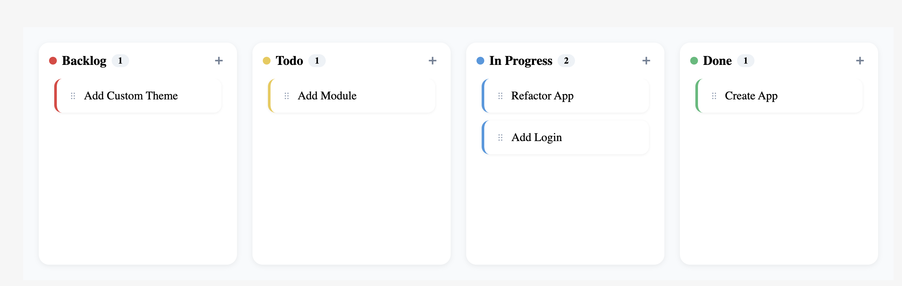

# retool-custom-components

A public repository with my own Retool Custom Components.

These components are designed to extend the functionality of Retool apps and provide reusable, customizable UI elements for a variety of use cases.

---

## 🧩 TaskBoard

**TaskBoard** is a Retool Custom Component that replicates the functionality of a project management board, enabling users to organize and track tasks visually across four customizable columns:

- **Backlog** 🔴  
- **Todo** 🟡  
- **In Progress** 🔵  
- **Done** 🟢  

#### ✨ Features

- ✅ Drag-and-drop task cards between columns  
- ➕ Add task functionality using the `+` button  
- 📝 Rename tasks by clicking on the task name  
- 🔁 One dynamic property per column to pass data to and from the Retool app

TaskBoard is ideal for managing project workflows, sprints, personal task tracking, or any use case that benefits from a kanban-style interface.

#### Images

Demo: 
